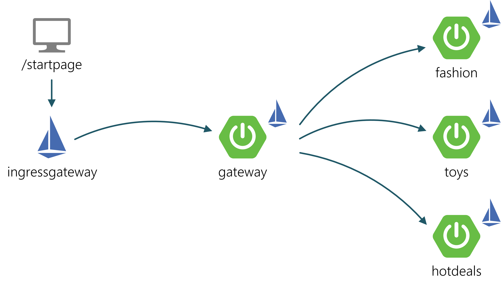

# Istio Chaos Shopping Demo

Demo of Chaos Engineering with Istio, Kubernetes and Spring Boot based on Benjamin Wilms' [Chaos Monkey for Spring Boot demo](https://github.com/MrBW/chaos-monkey-spring-boot-demo).

## Prerequisites

- Installed [kubectl](https://kubernetes.io/docs/tasks/tools/install-kubectl/)
- Installed [istioctl](https://istio.io/docs/ops/diagnostic-tools/istioctl/)
- Installed [minikube](https://kubernetes.io/docs/tasks/tools/install-minikube/)

## How to deploy to minikube cluster

1. Clone repository  
`git clone https://github.com/denniseffing/chaos-monkey-spring-boot-demo.git`
2. Checkout istio branch  
`git checkout istio`
3. Start up minikube cluster  
`minikube start --memory=6144 --cpus=4`
5. Install Istio into the cluster  
`istioctl manifest apply --set profile=demo --wait`
6. Deploy shopping demo to cluster  
`kubectl apply -f ./k8s`
7. Apply Istio configuration for shopping demo  
`kubectl apply -f ./istio`

## How to access

1. Enable loadbalanced services for minikube (keep process running in the background)  
`minikube tunnel` 
2. Retrieve IP of Istio's ingressgateway  
`kubectl -n istio-system get service istio-ingressgateway -o jsonpath='{.status.loadBalancer.ingress[0].ip}'`
3. Add IP to hosts file of your OS using hostname `shopping.demo`
4. Access shopping demo at `shopping.demo/startpage>`

## What you will find

